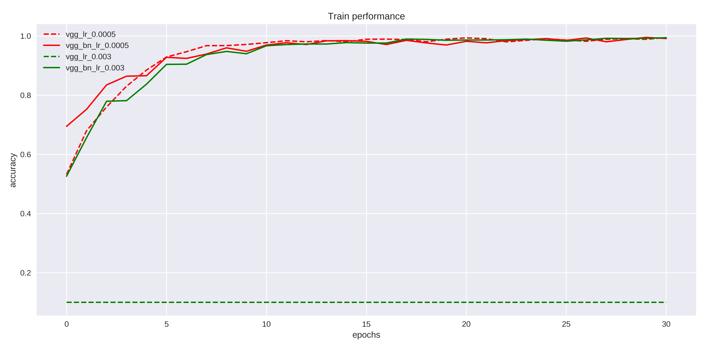
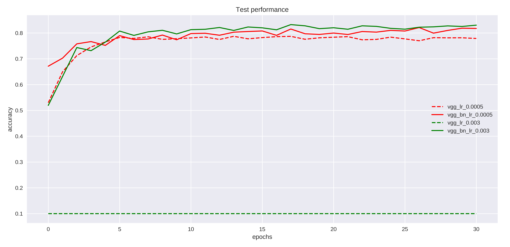
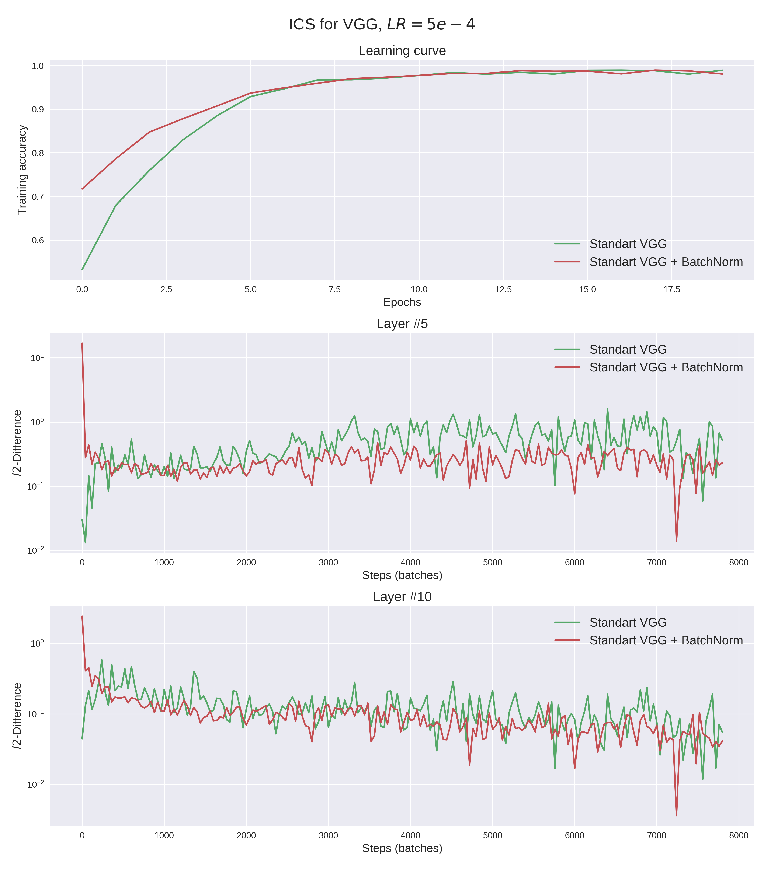
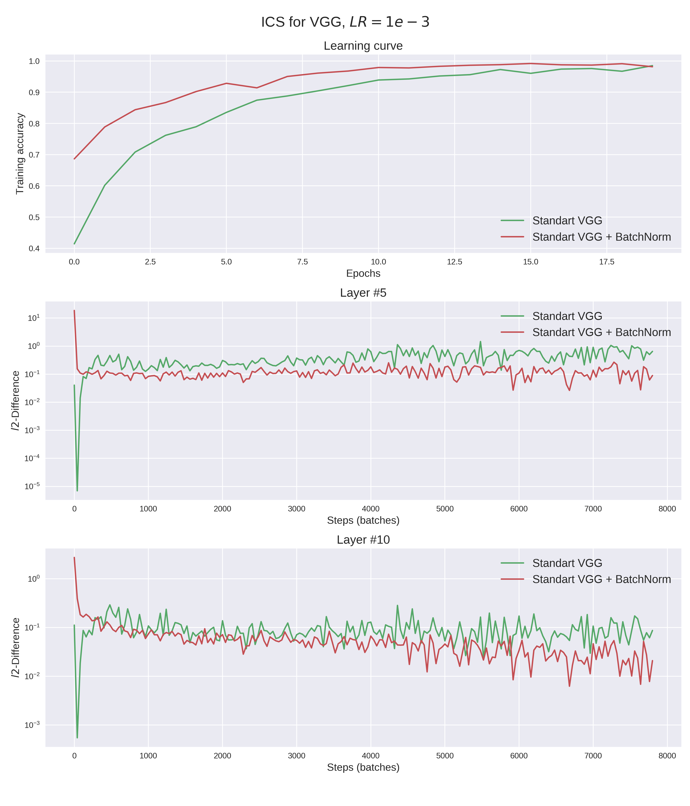
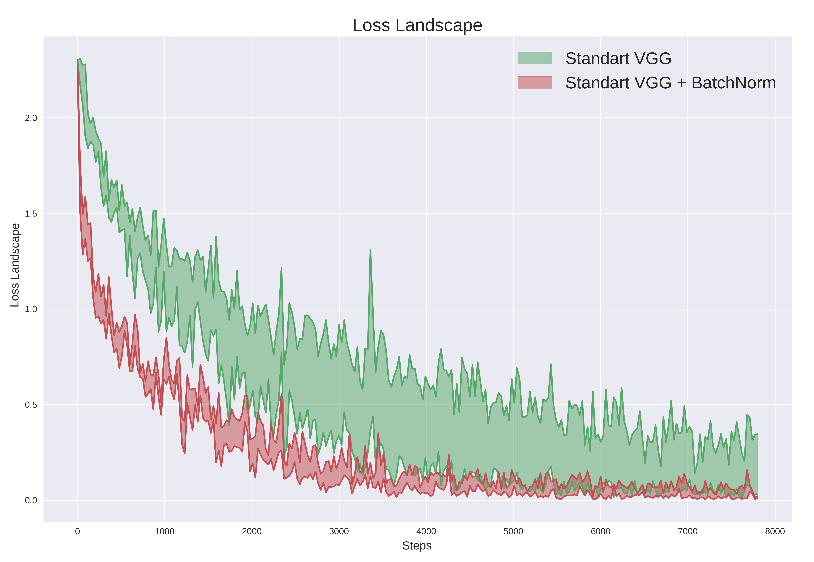
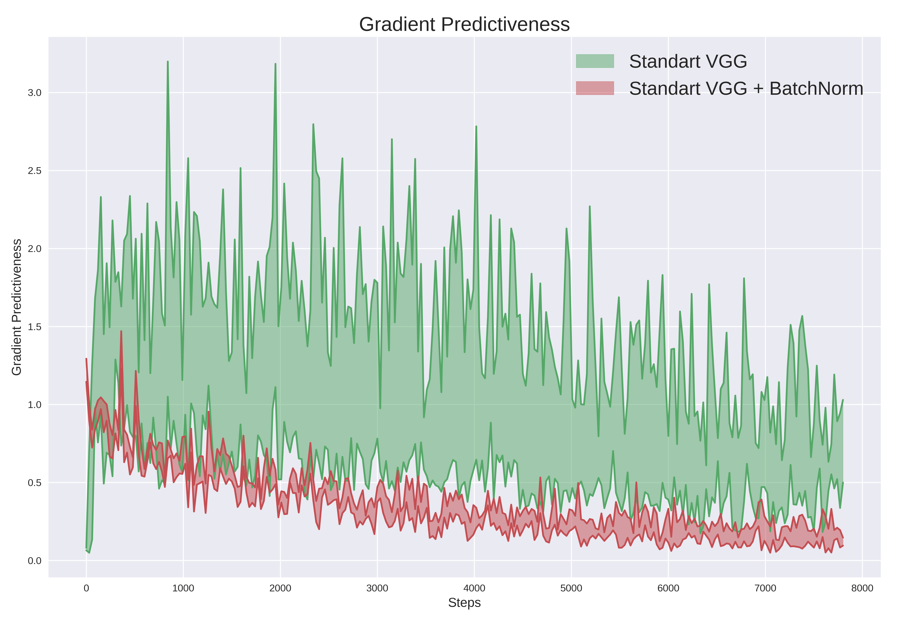
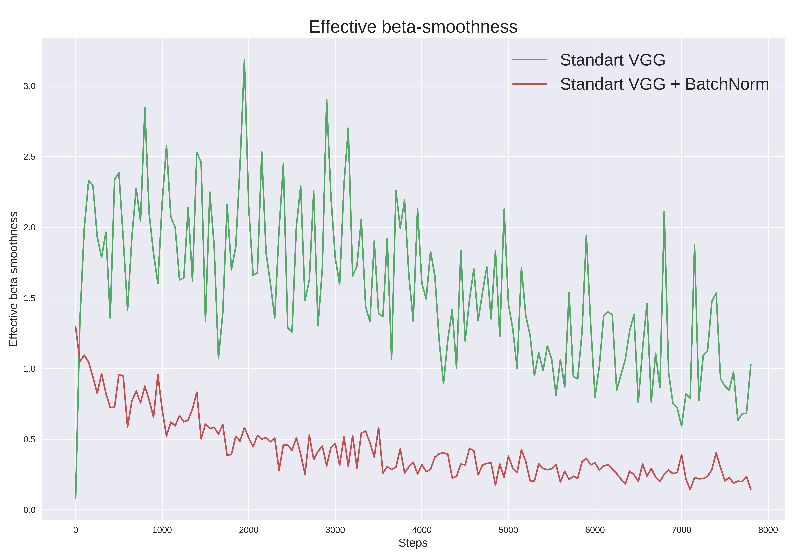

# Reproduction of "How does batch normalization helps optimization?" paper.

An attempt to reproduce several experiments from the paper "[How does batch normalization helps optimization?](https://papers.nips.cc/paper/7515-how-does-batch-normalization-help-optimization.pdf)".

## Main idea

Batch normalization is a widely adopted technique that enables faster and more stable training of deep neural networks.
Exact reasons of BatchNorm's effectiveness are still poorly understood and the popular belief is that it steems from 
controlling the layer's input distributions during training to reduce the "internal covariate shift".
  

Firsly, this work demonstrates, that distributional stability of layer inputs has little to do with the effectiveness 
of BatchNorm. Secondly, this work shows that the key impact of BatchNorm is the following: it reparametrizes the 
underlying optimization problem to *make its landscape significantly more smooth*. More presicely, BatchNorm improves 
Lipschizness of the loss function and, moreover, it also makes *gradients* of the loss more Lipschitz.  

## Results 

In all experiments we used CIFAR-10 dataset and VGG-A convolution neural network. We reduced the number of parameters 
in last three (Linear) layers since the size of input image is smaller: 32x32x3 vs 224x224x3 in original VGG. For model 
with BatchNorm, BatchNorms are located after every Convolution and Linear layers except the last one.

Comparison of performance of VGG with and without BatchNorm.

The next two figures visualise measurements of ICS (Internal Covariate Shift) in networks with and without BatchNorm 
layers (for more informations look at the paper or our report). Models with BatchNorm have similar, or even worse, 
internal covariate shift, despite performing better in terms of accuracy and loss.

The next figure shows the variance of loss for fixed range of learning rates.

The following figure shows the gradient predictiveness. It's the l2 distance between the loss gradient at a given point 
of the training and the gradients corresponding to different points along the original gradient direction. It shows a 
significant difference  in such gradient predictiveness between the vanilla and BatchNorm networks, especially early in 
training.

Next figure is the “effective” β-smoothness of the vanilla and BatchNorm networks throughout the training. Again, we 
observe consistent differences between these networks.

(c) Nikolay Skuratov, Alexey Bauman